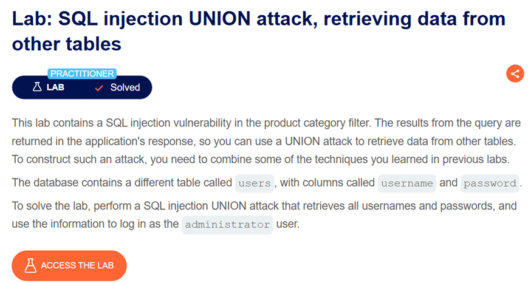
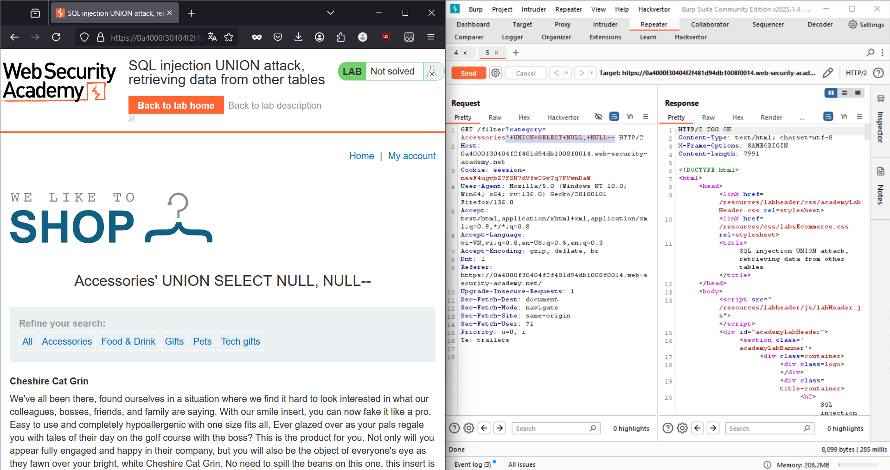
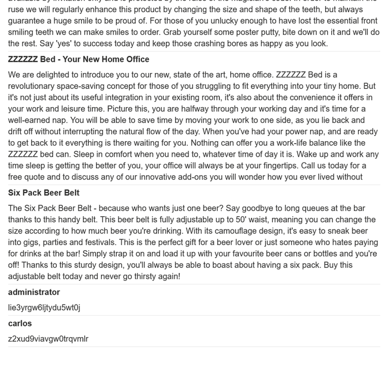
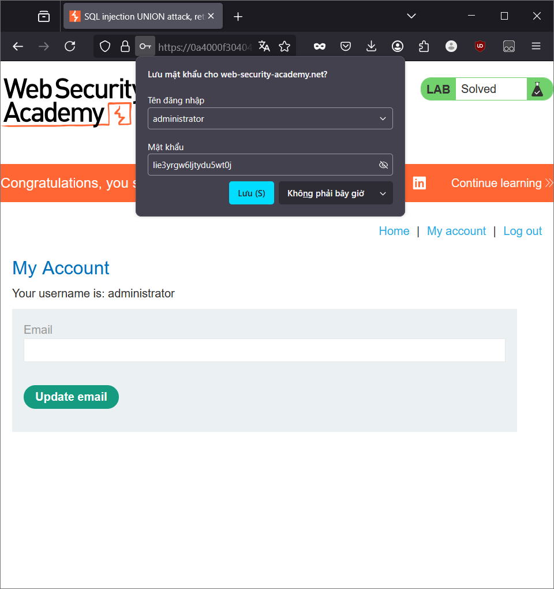

# Đầu bài cho biết:
- Có lỗ hổng SQL injection trong bộ lọc danh mục sản phẩm.
- Sử dụng tấn công UNION.
- Cơ sở dữ liệu có một bảng khác tên là users, với các cột username và password.

# Yêu cầu:
- Thực hiện tấn công SQL injection UNION để truy xuất tất cả tên người dùng và mật khẩu từ bảng users.
- Sử dụng thông tin này để đăng nhập với tư cách người dùng administrator.

- Tương tự những bài trước, ta tiếp tục khai thác chỗ danh mục bộ lọc
- Đầu tiên, vì dùng `UNION` nên cần xác định số lượng cột

- Vậy số lượng cột là 2.
- Tiếp theo, thay thế 2 cột đó bằng 2 cột `username` và `password` từ bảng `users`
- `' UNION SELECT username, password FROM users --`
- 

- Tài khoản mật khẩu của administrator đã hiện ra, dùng nó là hoàn thành lab

