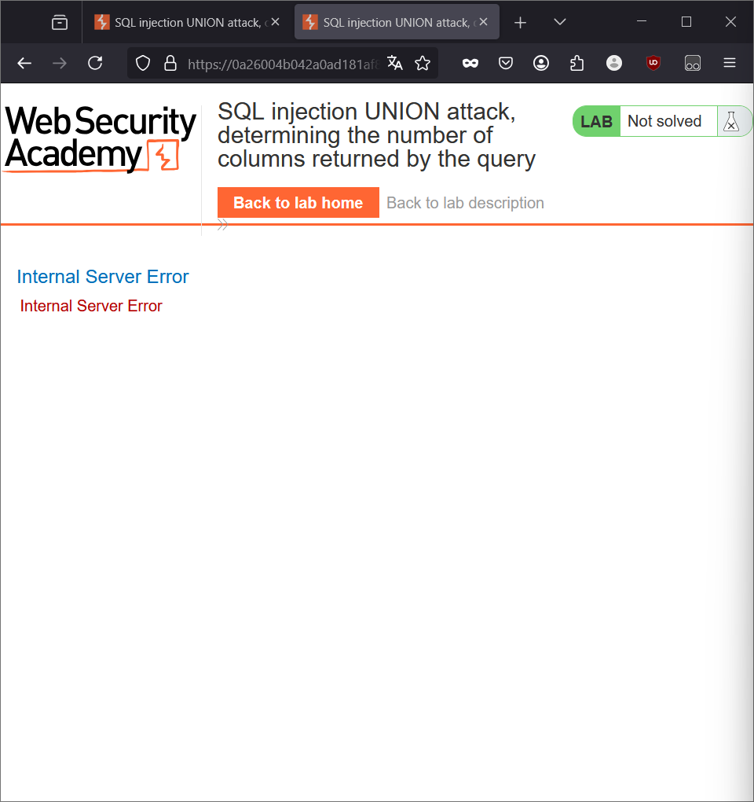
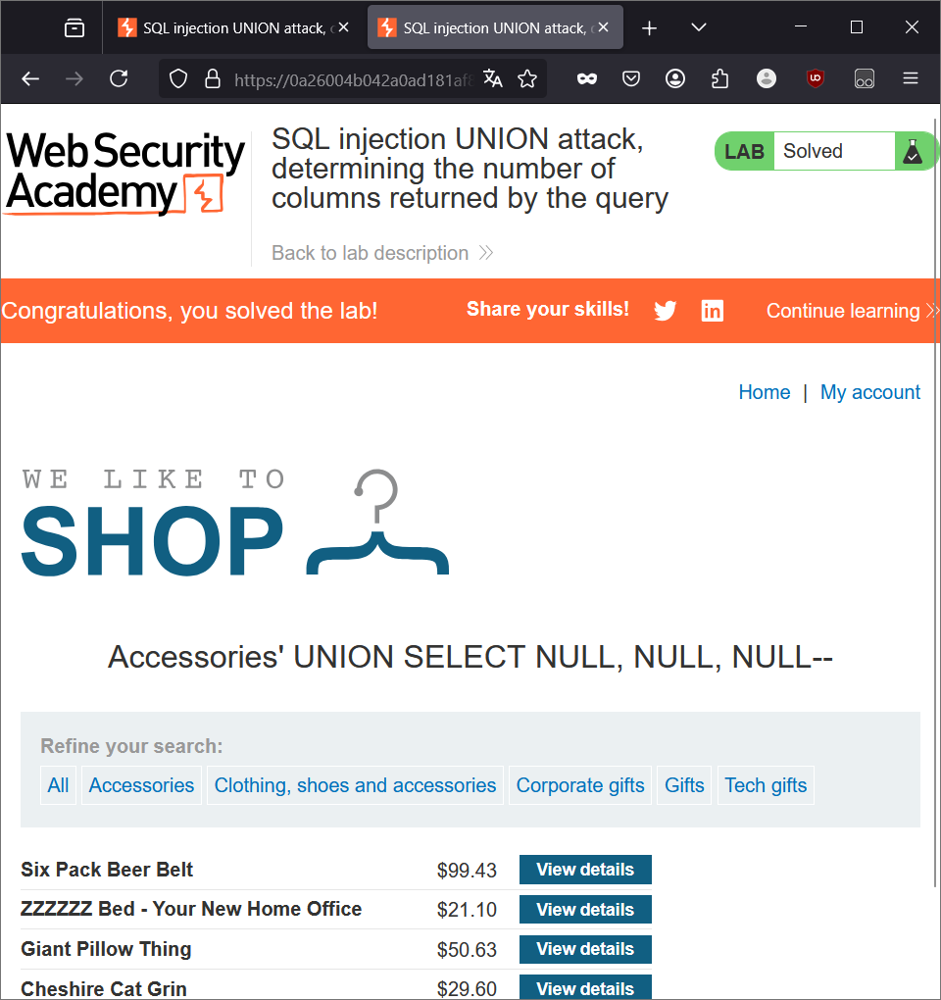

# Đầu bài cho biết
- Lab chứa lỗ hổng trong bộ lọc danh mục sản phẩm
- Kết quả truy vấn được trả về trong phản hồi của ứng dụng
- Có thể sử dụng tấn công UNION để truy xuất dữ liệu từ các bảng khác

# Yêu cầu
- Xác định số lượng cột

# Giải

- Ta đã biết là có lỗ hổng ở chỗ bộ lọc danh mục (như lab 1)
- Vào bài lab và chọn 1 danh mục bất kỳ
- Ta sẽ bắt được 1 request của danh mục đó, và gửi nó tới `Repeater`

- Để xác định được số lượng cột ta có 2 cách đó là:
  + SELECT NULL, NULL,..
  + ORDER BY n

- Cùng tương tự với bài lab 1, nó sẽ được gửi đi với truy vấn là:

`SELECT * FROM products WHERE category = 'Accessories' AND released = 1`

- Và chúng ta sẽ chèn vào từ chỗ bộ lọc danh mục (category)
- Thử với ` UNION SELECT NULL--`
- Thì truy vấn đấy sẽ thế này: `SELECT * FROM products WHERE category = 'Accessories' UNION SELECT NULL-- AND released = 1`

- Kết quả ra lỗi, vậy là sẽ có thêm các cột khác nữa. Ta tiếp tục thử
- ` UNION SELECT NULL, NULL--` -> Lỗi
- ` UNION SELECT NULL, NUll, NULL--`

