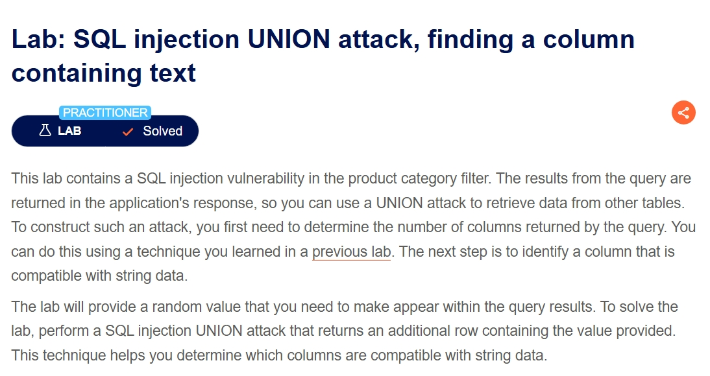
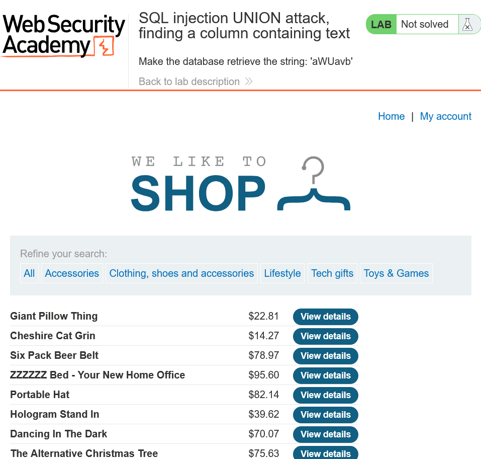
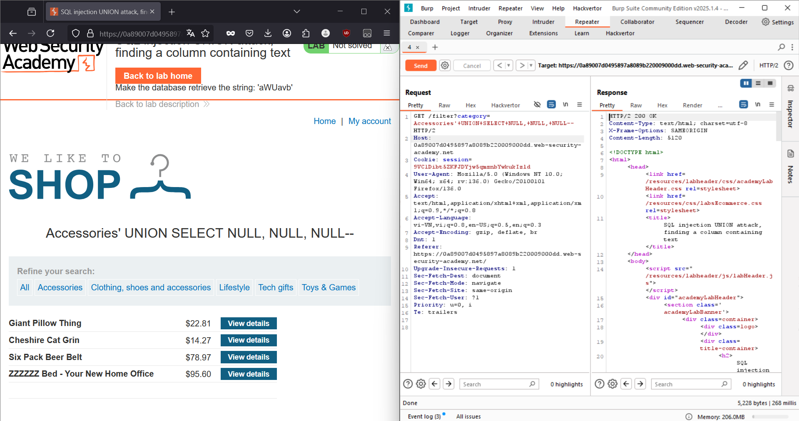
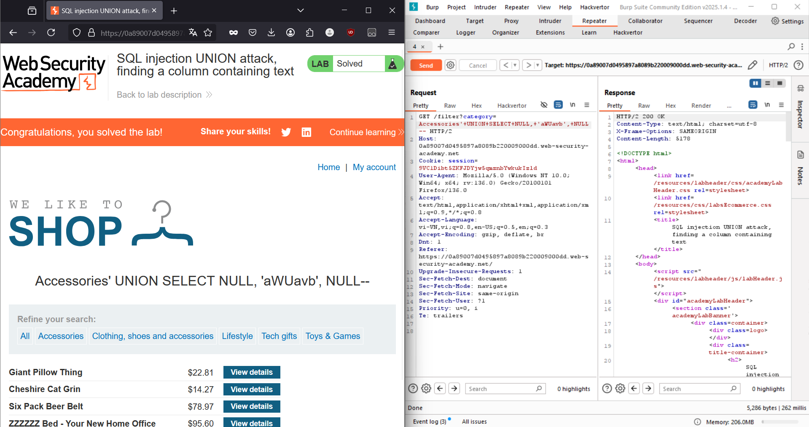

# Đầu bài cho biết:
- Có lỗ hổng SQL injection trong bộ lọc danh mục sản phẩm.
- Sử dụng tấn công UNION.
- Lab cung cấp một giá trị ngẫu nhiên cần đưa vào kết quả truy vấn.

# Yêu cầu:
- Thực hiện tấn công SQL injection UNION để trả về một hàng bổ sung chứa giá trị ngẫu nhiên được cung cấp.

- Bài yêu cầu tìm cột với giá trị 'aWUavb'

- Lỗ hổng vẫn ở chỗ bộ lọc danh mục như cũ
- Dùng `SELECT NULL,...` để kiểm tra số cột

- Vậy là có 3 cột, bây giờ ta thay thử `'aWUavb'` lần lượt cho các giá trị `NULL`

> Solved
